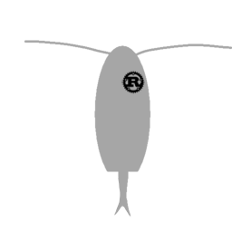

 
<h1 align = "center">plankton-rs</h1>

A port of [Osrepnay/Plankton](https://github.com/Osrepnay/Plankton) in Rust.

## Running the engine  
Running the engine requires Cargo.  
Run `cargo build --release` to create an executable, then run `./target/release/plankton` to start the engine.  

## Features
 - Minimax
 - Alpha-Beta pruning
 - Piece-Square tables
 - Quiescence search
 - Static Exchange Evaluation
 - Magic Bitboards
